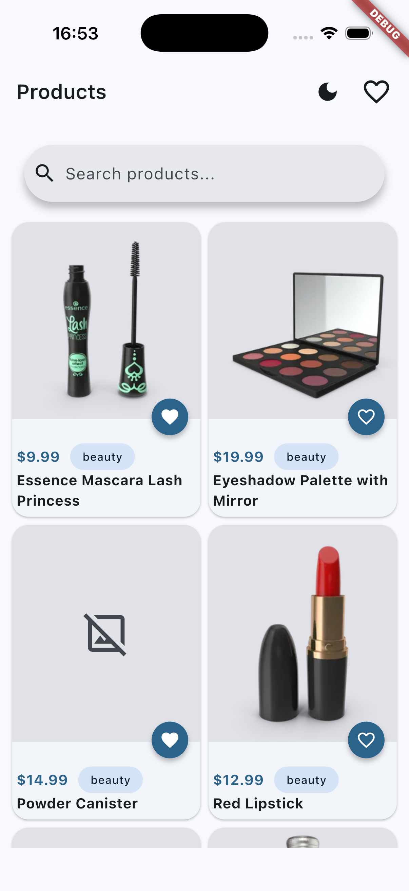
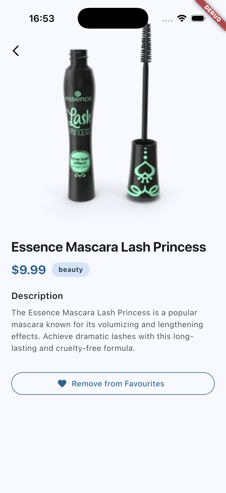
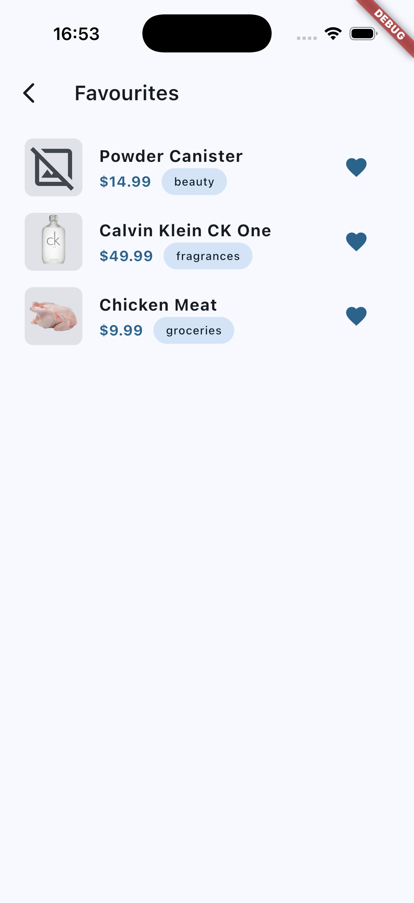
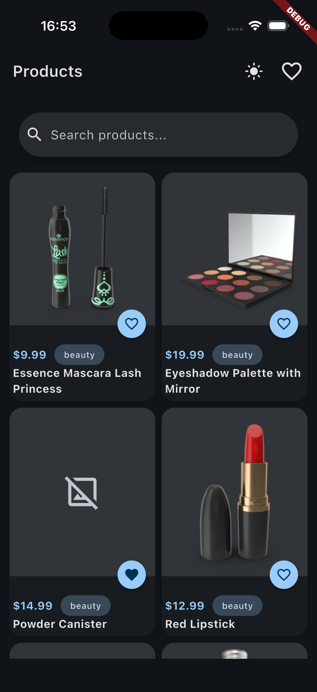
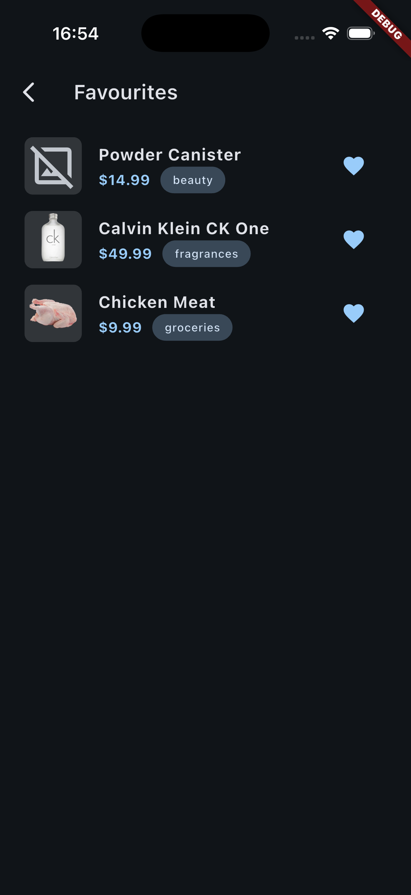

# Product Catalogue

## Project Overview

A Flutter app for browsing a product catalogue. Products are fetched from the
[dummyjson.com](https://dummyjson.com) API and displayed in a grid, with:

- Search by name/category (filtered locally against the fetched products)
- Product details screen with image, price, category, and description
- Favourites — mark/unmark products and view them on a dedicated screen
  (persisted locally, so favourites survive an app restart)
- Light/dark theme toggle

## Setup Instructions

### Install dependencies

```
flutter pub get
```

### Run the project

```
flutter run
```

### Build an APK

```
flutter build apk --release
```

The generated APK is written to `build/app/outputs/flutter-apk/app-release.apk`.

## Architecture

### Folder structure

A basic, flat folder structure is used since this is a small application —
no need for a more elaborate layered/feature-based architecture:

```
lib/
├── main.dart          # App entry point, provider setup
├── models/            # Data models (Product)
├── provider/           # State management (ProductProvider, FavoritesProvider, ThemeProvider)
├── repository/        # API layer (ProductRepository)
├── presentation/      # Screens (product list, product details, favourites)
├── routing/           # go_router route definitions
├── widgets/           # Reusable UI components (cards, search bar, loader, error view)
└── utils/             # Theming
```

### State management

The [`provider`](https://pub.dev/packages/provider) package is used, with a
`ChangeNotifier` per concern:

- `ProductProvider` — fetches products, holds loading/error state, and filters
  the product list for search
- `FavoritesProvider` — tracks favourited product IDs, persisted with
  `shared_preferences`
- `ThemeProvider` — light/dark theme mode

### API integration

Product data comes from the third-party [dummyjson.com](https://dummyjson.com)
REST API, used as a mock backend since the assignment didn't call for a real
one. `ProductRepository` wraps the `http` package calls and maps JSON
responses into `Product` models.

## Assumptions

- Limited the product fetch to 20 items (via the API's `limit` query param)
  rather than implementing pagination, to keep the scope appropriate for the
  assignment while still having a representative set of products to browse,
  search, and favourite.
- Skipped pagination/infinite-scroll for the same reason — kept the app
  simple and focused on the core requirements.
- Implemented search as a manual, local filter over the already-fetched
  products (by name/category) instead of using dummyjson's own
  `/products/search` endpoint. That endpoint searches its entire remote
  catalogue rather than just the 20 fetched products, which would let a user
  find and favourite a product outside the loaded set — filtering locally
  keeps the grid, search results, and favourites consistent with the same
  fixed set of products.
- Favourites are stored locally on-device (no backend/user account), since
  none was specified.

## Challenges

- **Search silently broke favourites.** After switching search from
  dummyjson's own `/products/search` endpoint to a manual local filter, a
  product favourited while searching could disappear from the favourites
  screen once the search was cleared. The filter was reassigning the same
  list used for both the current search view and favourite/product lookups,
  so each search narrowed that shared list instead of just changing what was
  displayed. Fixed by splitting it into a stable master list (source of
  truth for favourites/lookups) and a separate derived list for the search
  view.
- **A custom widget silently shadowed a Flutter one.** A hand-rolled search
  field widget was also named `SearchBar` — the same name as Flutter's own
  Material widget — so it resolved to the built-in one instead (no hint
  text, no `onChanged`, nothing wired up) with no compile error to flag it.
  Renamed the custom widget to `ProductSearchField` to remove the collision.
- **The search field kept disappearing while typing.** A `Consumer`'s
  loading/error/empty early-return was unmounting the search field on every
  keystroke, since searching briefly set `isLoading = true`. Fixed by moving
  the search field outside that `Consumer`.
- **The release APK failed to fetch products, debug worked fine.** The
  `INTERNET` permission was missing from `AndroidManifest.xml`. Debug builds
  are less strict about this in some setups, so it only surfaced when
  testing a real release build on a device.
- **Grid card image sizing.** A fixed `AspectRatio(1)` image inside a grid
  card caused a `RenderFlex overflow` once accompanying text pushed the
  card past its fixed grid-tile height. Wrapping the image in `Expanded`
  fixed the overflow, but revealed a second issue — a rigid aspect ratio
  fighting a flexible box left an uneven gap on one side. Switching the
  image to fill its box via `Positioned.fill` (`BoxFit.cover`) resolved both.

## Improvements

- Pagination / infinite scroll instead of a fixed 20-item limit
- Debounce search input to avoid filtering on every keystroke
- Cache network images (e.g. `cached_network_image`) instead of plain
  `Image.network`, for performance and offline resilience
- Sort/filter products by category or price

## Screenshots

### Light mode






### Dark mode



